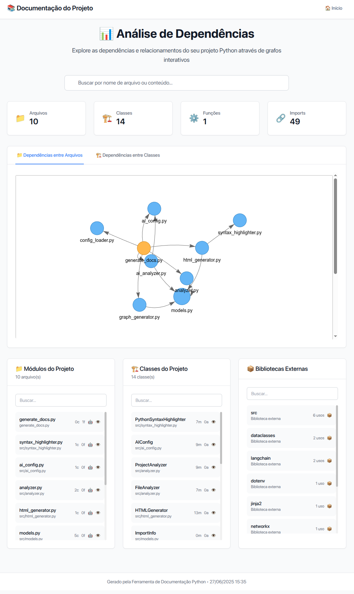
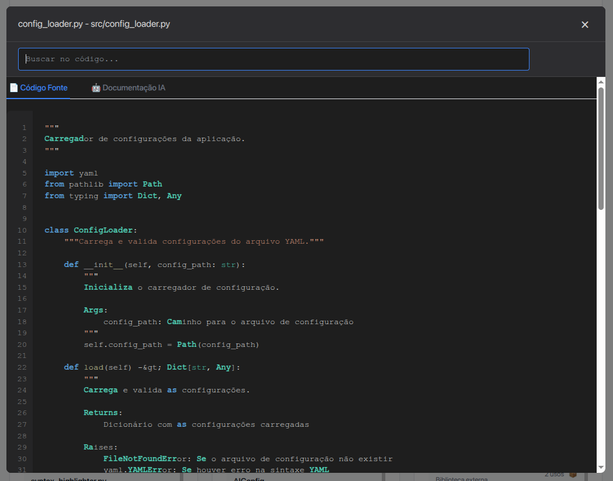
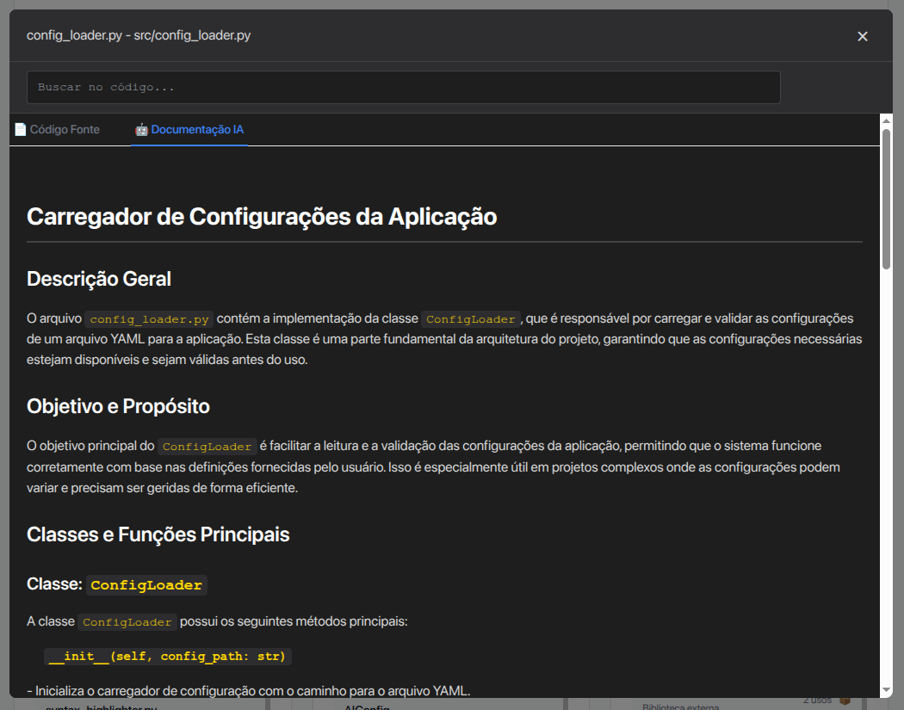

# 📊 Grapho

**Uma ferramenta inteligente que analisa seu código Python e gera documentação interativa, utilizando inteligência artificial e de forma automática!** 🚀

Transforme qualquer projeto Python em uma documentação visual e interativa com grafos de dependências, análise de código com IA e interface moderna. Perfeito para entender arquiteturas complexas, onboarding de novos desenvolvedores e documentação automática de projetos.





## ✨ O que esta ferramenta faz?

### 🔍 **Análise Automática de Código**
- Examina todos os arquivos `.py` do seu projeto
- Identifica classes, funções e dependências automaticamente
- Não executa seu código - apenas analisa estaticamente (100% seguro!)

### � **Visualização Interativa** 
- Cria grafos interativos mostrando como seus arquivos se conectam
- Visualiza relacionamentos entre classes (herança, composição)
- Interface web moderna que funciona em qualquer navegador

### 🤖 **Documentação Inteligente com IA**
- **NOVO!** Gera documentação automática usando OpenAI GPT
- Explica o que cada arquivo faz e seu propósito no projeto
- Identifica integrações e dependências importantes

### 👁️ **Visualizador de Código Avançado**
- Clique em qualquer arquivo nos grafos para ver o código
- Syntax highlighting igual ao VS Code
- Busca em tempo real dentro do código

## 🎯 Para quem é esta ferramenta?

- �‍💻 **Desenvolvedores** que querem entender projetos Python complexos
- � **Equipes** que precisam documentar arquiteturas de software
- 🎓 **Estudantes** aprendendo sobre estruturas de código
- 🏢 **Empresas** que querem automatizar documentação técnica

## 🚀 Instalação Rápida

### ⚠️ Pré-requisitos
Certifique-se de ter instalado:
- 🐍 **Python 3.8 ou superior** ([Download aqui](https://python.org/downloads/))
- 📦 **pip** (geralmente vem com Python)

### 📥 Passo a Passo

1. **📂 Clone ou baixe este projeto:**
   ```bash
   git clone https://github.com/marcelolimagomes/grapho.git
   cd grapho
   ```

2. **🔧 Instale as dependências:**
   ```bash
   pip install -r requirements.txt
   ```
   
   > 💡 **Dica:** Use um ambiente virtual para evitar conflitos:
   > ```bash
   > python -m venv venv
   > source venv/bin/activate  # Linux/Mac
   > # ou
   > venv\Scripts\activate     # Windows
   > pip install -r requirements.txt
   > ```

3. **✅ Teste se funcionou:**
   ```bash
   python generate_docs.py --help
   ```
   
   Se aparecer a ajuda do comando, tudo está funcionando! 🎉

## 📖 Como Usar - Guia para Iniciantes

### 🔥 Uso Básico (Sem IA)

**Para analisar um projeto Python qualquer:**

1. **Edite o arquivo `config.yaml`** (copie de `config_example.yaml` se necessário):
   ```yaml
   # Mude este caminho para o seu projeto Python
   root_directory: "/caminho/para/seu/projeto"
   
   # Que tipos de gráfico você quer ver?
   visualization_types:
     - "arquivos"    # Mostra dependências entre arquivos
     - "classes"     # Mostra relacionamentos entre classes
   
   # Onde salvar a documentação gerada
   output_directory: "./docs"
   ```

2. **Execute a análise:**
   ```bash
   python generate_docs.py
   ```

3. **Veja o resultado:**
   - Abra o arquivo `docs/index.html` no seu navegador
   - Explore os grafos interativos! 🎯

### 🤖 Uso Avançado (Com IA)

**Para ter documentação automática gerada por Inteligência Artificial:**

1. **Configure sua chave OpenAI:**
   ```bash
   # Copie o arquivo de exemplo
   cp .env.example .env
   ```
   
   Edite o arquivo `.env` e adicione sua chave da OpenAI:
   ```bash
   OPENAI_API_KEY=sua_chave_openai_aqui
   OPENAI_MODEL=gpt-4
   ```
   
   > 🔑 **Como obter uma chave OpenAI:**
   > 1. Acesse [platform.openai.com](https://platform.openai.com)
   > 2. Crie uma conta ou faça login
   > 3. Vá em "API Keys" e crie uma nova chave
   > 4. Cole a chave no arquivo `.env`

2. **Execute com IA:**
   ```bash
   # Para todos os arquivos (cuidado com os custos!)
   python generate_docs.py --enable-ai
   
   # Para limitar custos, analise apenas alguns arquivos:
   python generate_docs.py --enable-ai --max-ai-files 10
   ```

3. **Resultado:**
   - Mesma documentação anterior MAIS
   - Documentação automática gerada por IA explicando cada arquivo! 🧠

## 🖼️ O que você vai ver

Depois de executar a ferramenta, você terá:

### 📊 **Página Principal** (`docs/index.html`)
- Visão geral do projeto com estatísticas
- Grafos interativos de dependências
- Lista de arquivos e classes
- 📦 Box com bibliotecas externas detectadas

### 🕸️ **Grafos Interativos**
- **Clique nos nós** para ver o código fonte
- **Zoom e pan** para navegar em projetos grandes
- **Cores diferentes** para tipos de arquivos

### 👀 **Visualizador de Código**
- Syntax highlighting colorido
- Números de linha
- 🔍 **Busca em tempo real** no código
- Modal responsivo e moderno

### 🤖 **Documentação IA** (se habilitada)
- Explicação automática de cada arquivo
- Propósito e funcionalidade principal
- Integrações identificadas
- Aba especial "🤖 Documentação IA"

## �️ Configuração Detalhada

### ⚙️ Arquivo `config.yaml`

```yaml
# 📁 ONDE ESTÁ SEU PROJETO PYTHON?
root_directory: "../meu-projeto"  # Mude este caminho!

# 📊 QUE TIPOS DE GRÁFICO VOCÊ QUER?
visualization_types:
  - "arquivos"    # Dependências entre arquivos
  - "classes"     # Relacionamentos entre classes

# 💾 ONDE SALVAR A DOCUMENTAÇÃO?
output_directory: "./docs"

# 🚫 ARQUIVOS/PASTAS PARA IGNORAR
ignore_patterns:
  - "__pycache__"    # Cache do Python
  - "*.pyc"          # Arquivos compilados
  - ".git"           # Controle de versão
  - "venv"           # Ambiente virtual
  - "migrations"     # Migrações Django
  - "tests"          # Pasta de testes (opcional)
  
# 🎨 CONFIGURAÇÕES VISUAIS
graph_config:
  width: "100%"              # Largura dos grafos
  height: "800px"            # Altura dos grafos
  physics_enabled: true      # Animação física (pode desligar se lento)
```

### 🤖 Arquivo `.env` (Para IA)

```bash
# 🔑 SUA CHAVE DA OPENAI (OBRIGATÓRIA PARA IA)
OPENAI_API_KEY=sk-proj-sua_chave_aqui

# 🧠 QUAL MODELO USAR?
OPENAI_MODEL=gpt-4           # Melhor qualidade (mais caro)
# OPENAI_MODEL=gpt-3.5-turbo # Mais barato, qualidade boa

# 🎛️ CONFIGURAÇÕES AVANÇADAS
OPENAI_TEMPERATURE=0.3       # Criatividade (0.0 = conservador, 1.0 = criativo)
OPENAI_MAX_TOKENS=2000       # Tamanho máximo das respostas

# 🌍 IDIOMA DA DOCUMENTAÇÃO
DOCUMENTATION_LANGUAGE=pt-BR  # ou en-US para inglês

# ✅ HABILITAR IA POR PADRÃO?
ENABLE_AI_DOCUMENTATION=true
```

> 💰 **Sobre Custos da OpenAI:**
> - GPT-3.5-turbo: ~$0.002 por 1K tokens (mais barato)
> - GPT-4: ~$0.03 por 1K tokens (melhor qualidade)
> - Use `--max-ai-files 10` para limitar custos!

## 🎯 Exemplos Práticos

### � Exemplo 1: Analisando um Projeto Django

```bash
# 1. Configure o config.yaml
root_directory: "/home/user/meu-projeto-django"

# 2. Execute
python generate_docs.py

# 3. Resultado: Você verá
# - Como seus apps Django se conectam
# - Dependências entre models.py, views.py, etc.
# - Bibliotecas como Django, DRF detectadas automaticamente
```

### 💡 Exemplo 2: Projeto Flask com IA

```bash
# 1. Configure sua chave OpenAI no .env
# 2. Execute com limite de custos
python generate_docs.py --enable-ai --max-ai-files 15

# 3. Resultado: Documentação + IA explicando:
# - "Este arquivo contém as rotas principais da API..."
# - "Este model representa usuários do sistema..."
# - "Esta view processa dados de formulários..."
```

### 💡 Exemplo 3: Biblioteca Python

```bash
# Para projetos menores, pode usar IA em todos os arquivos
python generate_docs.py --enable-ai

# Ideal para:
# - Entender bibliotecas de terceiros
# - Documentar suas próprias libs
# - Onboarding de novos desenvolvedores
```

## 🚨 Problemas Comuns e Soluções

### ❌ "Erro: Arquivo de configuração não encontrado"
```bash
# Solução: Crie o arquivo config.yaml
cp config_example.yaml config.yaml
# Edite o arquivo e mude o root_directory
```

### ❌ "Erro: Diretório raiz não existe"
```bash
# Solução: Verifique o caminho no config.yaml
# Use caminho absoluto, exemplo:
root_directory: "/home/usuario/meu-projeto"
# ou no Windows:
root_directory: "C:/Users/Usuario/meu-projeto"
```

### ❌ "IA não funciona"
```bash
# 1. Verifique se configurou a chave corretamente:
python test_ai_features.py

# 2. Certifique-se que o arquivo .env existe:
cp .env.example .env
# Edite e adicione: OPENAI_API_KEY=sua_chave_aqui
```

### ❌ "Grafos vazios ou estranhos"
- ✅ Verifique se há arquivos `.py` na pasta especificada
- ✅ Confira se os arquivos têm sintaxe Python válida
- ✅ Revise os `ignore_patterns` - talvez esteja ignorando arquivos importantes

### ❌ "Muito lento"
```bash
# Para projetos grandes (100+ arquivos):
# 1. Ignore pastas desnecessárias no config.yaml
ignore_patterns:
  - "tests"
  - "migrations" 
  - "node_modules"
  - "venv"

# 2. Desative física dos grafos
graph_config:
  physics_enabled: false

# 3. Limite IA
python generate_docs.py --enable-ai --max-ai-files 20
```

### 🌐 "Erro no navegador"
```bash
# Para melhor compatibilidade, use um servidor local:
cd docs
python -m http.server 8000
# Acesse: http://localhost:8000
```

## 🧪 Scripts de Teste (Para Desenvolvedores)

Se você quer testar todas as funcionalidades:

```bash
# 🔍 Teste básico da ferramenta
python test_docs.py

# 🤖 Teste funcionalidades de IA (precisa da chave OpenAI)
python test_ai_features.py

# 👀 Demo do visualizador de código
python demo_code_viewer.py

# 🎭 Demo da IA (funciona sem chave real)
python demo_ai.py

# 📊 Resumo da implementação
python implementation_summary.py
```

## 🎨 Estrutura dos Arquivos Gerados

Após executar a ferramenta, você terá esta estrutura:

```
docs/
├── 🏠 index.html              # Página principal - ABRA ESTA!
├── 📊 files_graph.html        # Grafo de dependências entre arquivos
├── 🔗 classes_graph.html      # Grafo de relacionamentos entre classes
├── 📁 modules/                # Páginas individuais de cada arquivo
│   ├── main.html
│   ├── utils_parser.html
│   └── ...
├── 🏛️ classes/                # Páginas individuais de cada classe
│   ├── User.html
│   ├── DataProcessor.html
│   └── ...
└── 💎 assets/                 # Estilos e scripts
    ├── style.css
    └── script.js
```

## � Comandos Rápidos

```bash
# 🚀 USO BÁSICO
python generate_docs.py

# 🤖 COM IA (TODOS OS ARQUIVOS)
python generate_docs.py --enable-ai

# 💰 COM IA (LIMITANDO CUSTOS)
python generate_docs.py --enable-ai --max-ai-files 10

# ⚙️ COM CONFIGURAÇÃO PERSONALIZADA
python generate_docs.py --config meu_config.yaml

# 🎯 COMBINANDO OPÇÕES
python generate_docs.py --config custom.yaml --enable-ai --max-ai-files 15
```

## 🏗️ Como Funciona (Para Curiosos)

### 🔍 Análise Estática
1. Lê todos os arquivos `.py` do projeto
2. Usa a biblioteca `ast` do Python para analisar código
3. Identifica imports, classes, funções, dependências
4. Monta um grafo de relacionamentos

### 🤖 Análise com IA
1. Envia código para OpenAI GPT
2. IA analisa e gera documentação em português
3. Identifica propósito, integrações, funcionalidades
4. Integra na interface web

### 🌐 Interface Web
1. Gera HTML com grafos interativos usando PyVis
2. Adiciona syntax highlighting estilo VS Code
3. Cria modais responsivos para visualização
4. Implementa busca em tempo real

## 🤝 Contribua com o Projeto!

### 🌟 Como Ajudar

- ⭐ **Dê uma estrela** no repositório se gostou!
- 🐛 **Reporte bugs** abrindo uma issue
- 💡 **Sugira melhorias** ou novas funcionalidades
- 🔧 **Contribua com código** fazendo um pull request
- 📖 **Melhore a documentação**

### 💻 Áreas que Precisam de Ajuda

- 🆕 Suporte a notebooks Jupyter (.ipynb)
- 🎨 Novos temas visuais
- 🚀 Otimizações de performance
- 📊 Novos tipos de análise
- 🌍 Tradução para outros idiomas
- 🔌 Plugins para editores (VS Code, PyCharm)

### 📋 Como Contribuir

1. **Fork** este repositório
2. **Clone** seu fork localmente
3. **Crie** uma branch para sua feature
4. **Implemente** suas mudanças
5. **Teste** tudo funcionando
6. **Submeta** um pull request

```bash
git fork https://github.com/marcelolimagomes/grapho
git clone https://github.com/marcelolimagomes/grapho.git
git checkout -b minha-feature
# ... faça suas mudanças ...
git add .
git commit -m "feat: adiciona nova funcionalidade X"
git push origin minha-feature
# Abra um Pull Request no GitHub!
```

## � Contato e Autor

### 👨‍💻 Sobre o Desenvolvedor

**Marcelo Lima Gomes** - Desenvolvedor apaixonado por Python e tecnologias de análise de código.

🔗 **Entre em contato:**
- 💼 **LinkedIn:** [https://www.linkedin.com/in/marcelolimagomes/](https://www.linkedin.com/in/marcelolimagomes/)
- 📧 **E-mail:** marcelolimagomes@gmail.com
- 🐙 **GitHub:** [https://github.com/marcelolimagomes/](https://github.com/marcelolimagomes/)

### 🤝 Vamos Conectar!

- 🌟 **Gostou do projeto?** Dê uma estrela no repositório!
- 💬 **Tem sugestões?** Abra uma issue ou envie um pull request!
- 🔗 **Vamos nos conectar no LinkedIn!** Adoro conversar sobre tecnologia e programação
- 📧 **Dúvidas ou feedback?** Mande um e-mail!

### 🎯 Contribuições Bem-Vindas!

Este projeto foi criado com ❤️ para a comunidade Python. Suas sugestões e contribuições são muito importantes para melhorar a ferramenta!

**Formas de contribuir:**
- 🐛 Reportar bugs
- 💡 Sugerir novas funcionalidades
- 📖 Melhorar documentação
- 🔧 Contribuir com código
- ⭐ Dar uma estrela no repositório

## �📄 Licença

Este projeto está sob a licença MIT. Veja o arquivo LICENSE para mais detalhes.

## 🔮 Roadmap - Próximas Funcionalidades

### 🚧 Em Desenvolvimento
- [ ] 📓 Suporte a notebooks Jupyter (.ipynb)
- [ ] 💾 Cache de análise IA para evitar reprocessamento
- [ ] 📊 Análise de dependências por função (mais granular)
- [ ] 📄 Exportação para PDF/Markdown

### 🎯 Planejadas
- [ ] 🔄 Integração com CI/CD (GitHub Actions)
- [ ] 🌐 API REST para análise programática
- [ ] 🔌 Plugins para editores (VS Code, PyCharm)
- [ ] 📈 Análise de qualidade de código
- [ ] 🔍 Detecção de código duplicado
- [ ] 📊 Métricas de complexidade
- [ ] 🌍 Interface em inglês e outros idiomas

### 💡 Quer Sugerir Algo?

Tem alguma ideia incrível? Abra uma issue com a tag `enhancement` e vamos discutir!

## 🎉 Status do Projeto

### ✅ 100% Funcional
Esta ferramenta está **pronta para uso em produção** com todas as funcionalidades principais implementadas e testadas:

- [x] 🔍 Análise estática completa de código Python
- [x] 📊 Grafos interativos de dependências (arquivos e classes)
- [x] 👁️ Visualizador de código com syntax highlighting
- [x] 🔍 Busca em tempo real no código fonte
- [x] 📦 Detecção automática de bibliotecas externas
- [x] 🤖 Documentação inteligente com IA (OpenAI + LangChain)
- [x] 📱 Interface responsiva e moderna
- [x] ⚙️ Configuração flexível via arquivos
- [x] 🧪 Scripts de teste e demonstração
- [x] 🛡️ Tratamento robusto de erros

---

## 🚀 Começe Agora!

```bash
# Clone o projeto
git clone https://github.com/marcelolimagomes/grapho.git
cd grapho

# Instale dependências
pip install -r requirements.txt

# Configure seu projeto
cp config_example.yaml config.yaml
# Edite config.yaml com o caminho do seu projeto

# Execute!
python generate_docs.py

# Abra docs/index.html e explore! 🎯
```

**✨ Transforme seu código Python em documentação inteligente e interativa!**

*Se esta ferramenta te ajudou, considere dar uma ⭐ no repositório e conectar-se comigo no LinkedIn!* 😊
